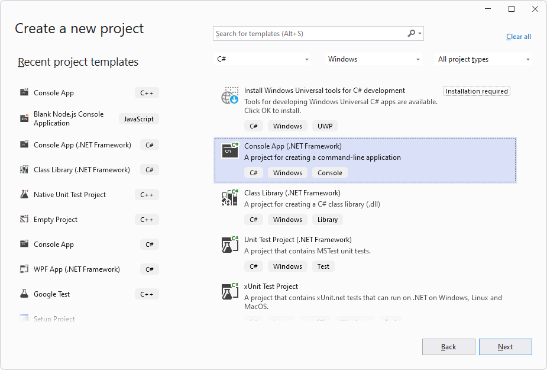
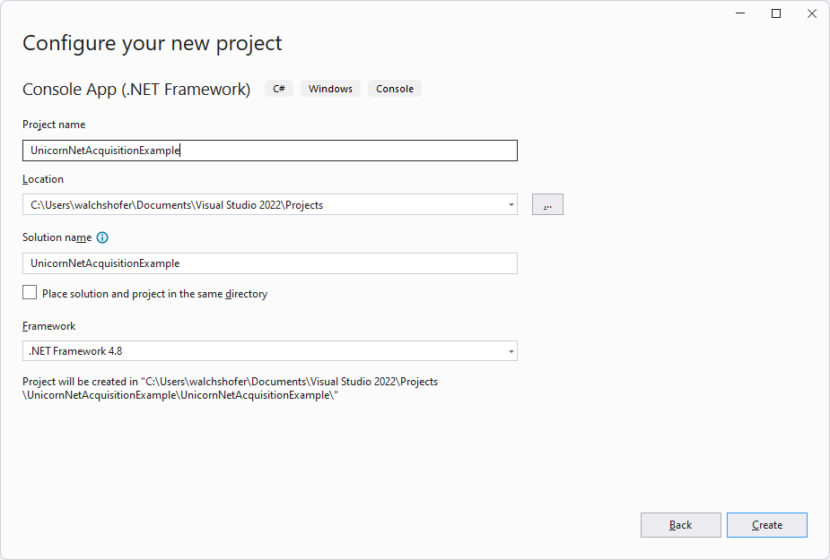
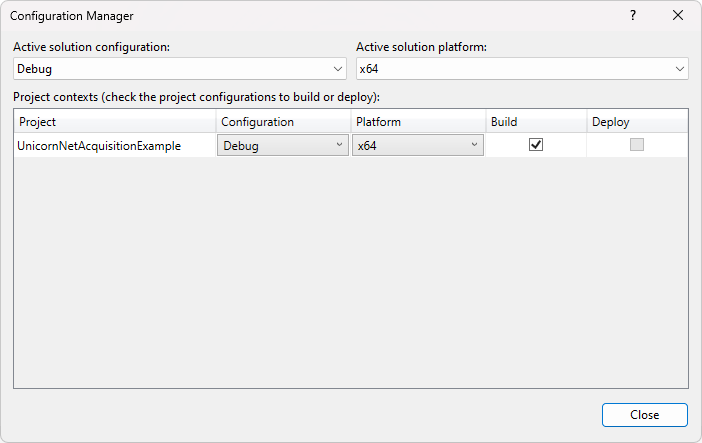
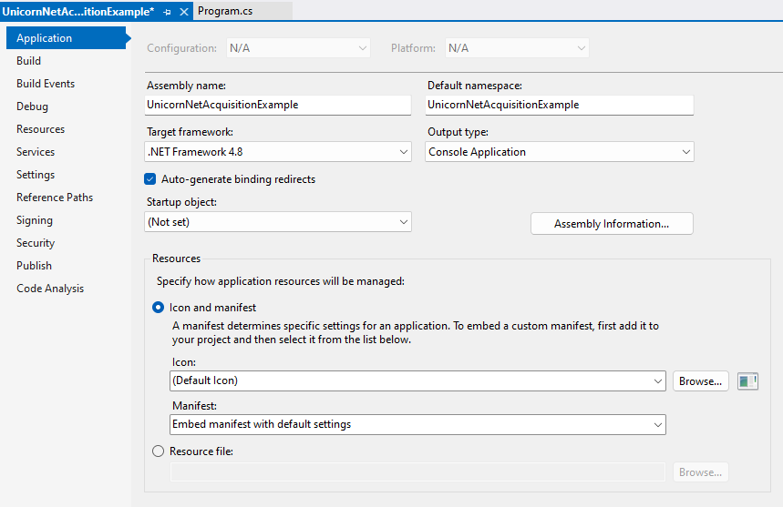
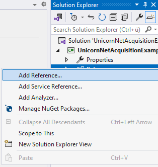
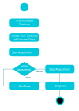

# UNICORN .NET API
The Unicorn .NET API is a .NET application programming interface (API) that enables C# and other .NET applications to communicate with Unicorn brain interfaces. The Unicorn .NET API allows users to acquire data from Unicorn devices easily without having to take care of low-level data acquisition issues. The raw binary data stream is converted into numerical values such that the user receives data ready to analyze.

[Requirements](#Requirements)<br/>
[Files on your computer](#Files-on-your-computer)<br/>
[Setting up a project using Visual Studio 2022](#Setting-up-a-project-using-Visual-Studio-2022)</br>
[Command Order](#Command-Order)</br>
[Unicorn .NET API Video Tutorial](#Unicorn-NET-API-Video-Tutorial)</br>
[.NET API Reference](./unicorn-dotnet-api-reference.md)</br>

## Requirements
- NET Framework <br/> .NET Framework 4.8
- Visual Studio<br/> Microsoft Visual Studio 2022

## Files on your computer
By default, the Unicorn .NET API library is installed into the Documents folder.
- C:\Users\<username>\Documents\gtec\Unicorn Suite\Hybrid Black\Unicorn DotNet<br/>Standard installation folder for the Unicorn .NET API
library

Within this directory, subdirectories are generated containing all installed files
- .\Lib<br/>Contains the Unicorn .NET API for Windows 64-bit
- .\Examples<br/>Contains application examples for the Unicorn .NET 
API

## Setting up a project using Visual Studio 2022
1. Open Visual Studio 2022.
2. Create a new C# Console application (Console App (.NET Framework)).
<br/>
<p align="center">
<br/>
</p>
<p align="center">
<br/>
</p>

3. Open the Configuration Manager and set the “Active solution platform” and project “Platform” to “x64”
<br/>
<p align="center">
<br/>
</p>

4. Open the project properties dialog (Project → Properties).
5. Set the target framework to “.NET Framework 4.8”.
<br/>
<p align="center">
<br/>
</p>

6. Select “Add Reference” by right clicking “References” in the Solution Explorer
<br/>
<p align="center">
<br/>
</p>

7. Browse to the library path of the Unicorn .NET API (by default C:\Users\<username>\Documents\gtec\Unicorn Suite\Hybrid Black\Unicorn DotNet\Lib) and add “UnicornDotNet.dll” as reference.
8. Add “using Gtec.Unicorn” to the top of each file using the Unicorn .NET API.

```
using Gtec.Unicorn;
namespace UnicornNetAcquisitionExample
{
    class Program
    {
        static void Main(string[] args)
        {
            Console.WriteLine("API Version: " + Unicorn.GetApiVersion());
            Console.ReadLine();
        }
    }
}
 ```

9.  You must copy the native Unicorn library (by default C:\Users\<username>\Documents\gtec\Unicorn Suite\Hybrid Black\Unicorn DotNet\Lib\Unicorn.dll) to the execution folder of the C# application. This can be done manually or within the “Build Events” by adding the following ines to the Pre- or Post-build event command Lines

```
echo Copying Unicorn libraries...
copy "C:\Users\<username>\Documents\gtec\Unicorn Suite\Hybrid Black\Unicorn 
DotNet\Lib\Unicorn.dll" "$(TargetDir)"
```

## Command Order
To perform a data acquisition using the Unicorn .NET API, a defined command execution order is required.

<p align="center">
<br/>
</p>

1.  Before connecting to a Unicorn device, it is possible to check the operating environment of Unicorn devices and to discover available devices.

2. A connection must be established to communicate with the Unicorn brain interface. To do so, create an instance of the Unicorn class. If the instance could be created, the connection attempt was executed successfully. After connecting to a device, it is possible to interact with the device and to call all available public member functions of the Unicorn class. For example, it is possible to read the current configuration of the device, set a new configuration or start data acquisition.


3.  To start data acquisition, Start Acquisition must be called. After calling Start Acquisition, the Unicorn device is set into acquisition mode and is continuously sending data.

4.  Therefore, it is necessary to read the incoming data stream continuously by calling Get Data within an acquisition loop. Other API calls (except Stop Acquisition and Set Digital Outputs) are not allowed while data acquisition is running

5.  To stop data acquisition, Stop Acquisition must be called. The Unicorn device will terminate the data stream. The device is still connected. It is possible to interact with the device as long as the corresponding class instance is kept alive.

6. The device gets disconnected as soon as the garbage collector finalizes the corresponding class instance, or Dispose is called. Afterwards, it is not possible to interact with the device anymore. The device must be opened again for interaction.

## Unicorn .NET API Video Tutorial<a name="Unicorn-NET-API-Video-Tutorial"></a>
<div align="center">

[](https://youtu.be/U8xWlIyY4DI "Unicorn Hybrid Black Tutorial: Dev Tools - .NET API")

</div>