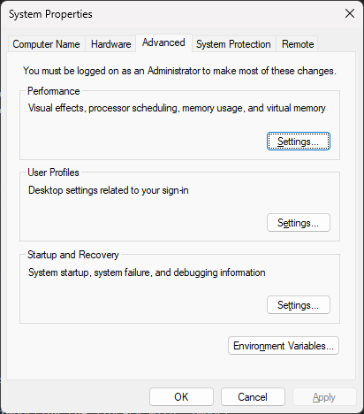
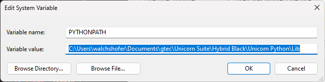
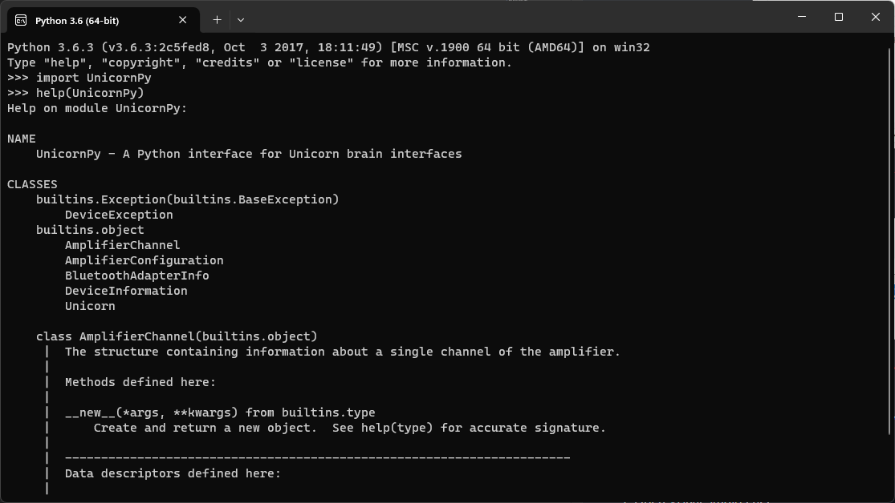
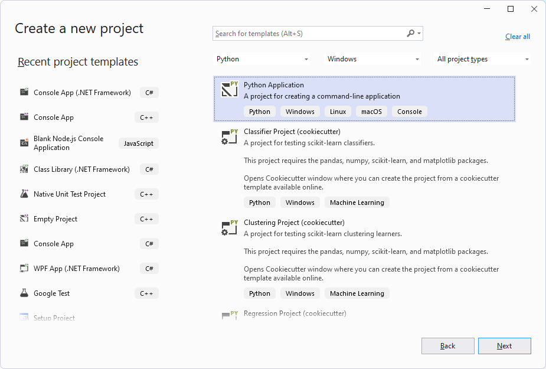
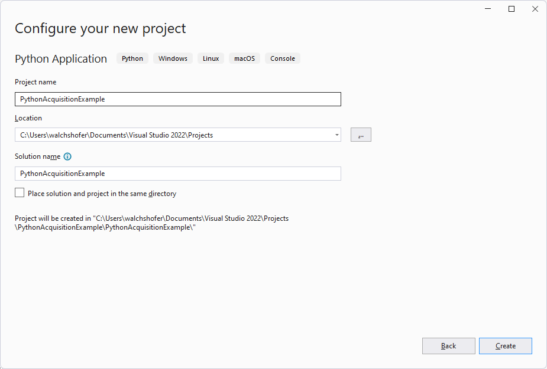
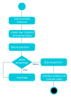

# UNICORN PYTHON API
The Unicorn Python API is a Python application programming interface (API) enabling the communication with Unicorn brain interfaces from Python. The Unicorn Python API allows users to acquire data from Unicorn devices easily without having to take care of low-level data acquisition issues. The raw binary data stream is converted into numerical values such that the user receives data ready to analyze.

[Requirements](#Requirements)<br/>
[Files on your computer](#Files-on-your-computer)<br/>
[Using the Unicorn Python Api](#Using-the-Unicorn-Python-Api)</br>
&nbsp;&nbsp;&nbsp;[Activate License](#Activate-License)<br/>
&nbsp;&nbsp;&nbsp;[Set library path](#Set-library-path)<br/>
[Setting up a project using Visual Studio 2022](#Setting-up-a-project-using-Visual-Studio-2022)</br>
[Command Order](#Command-Order)</br>
[Unicorn Python API Video Tutorial](#Unicorn-Python-API-Video-Tutorial)</br>
[Python API Reference](./unicorn-dotnet-api-reference.md)</br>

## Requirements
- Python<br/> > Python 3.3 – x64<br/>NumPy
- Visual Studio<br/> Microsoft Visual Studio 2022, Python Development Tools

## Files on your computer
By default, the Unicorn Python API library is installed to the Documents folder.
- C:\Users\<username>\Documents\gtec\Unicorn Suite\Hybrid Black\Unicorn Python<br/>Standard installation folder for the Unicorn Python API library

Within this directory, subdirectories are generated containing all installed files
- .\Lib<br/>Contains the Unicorn Python API for Windows 64-bit
- .\Examples<br/>Contains application examples for the Unicorn Python API library in Python

## Using the Unicorn Python Api
## Activate License
The Unicorn Python library requires a license key to load. Unlock the Unicorn Python API by following the instructions from  the [Licensing](TODO).

## Set library path
You must add the Unicorn Python library paths to the system environment variable PYTHONPATH to be able to use the library in Python applications.

1. Open the “System Properties” and go to the “Advanced” tab.

<p align="center">
<br/>
</p>

2. Click “Environment Variables” and add a new “System variable” called PYTHONPATH pointing to the Unicorn Python library folder.

<p align="center">
<br/>
</p>

3.  It should be possible to load the library by typing “import UnicornPy” in Python after adding the library folder to the python path.

<p align="center">
<br/>
</p>

## Setting up a project using Visual Studio 2022
1. Open Visual Studio 2022.
2. Create a new Python application.
<p align="center">
<br/>
</p>
<p align="center">
<br/>
</p>

3. Make sure that the library path is set as described in '[Set library path](#Set-library-path)'.
4. Import the Unicorn Python API by importing the library with “import UnicornPy”

```
import UnicornPy
help(UnicornPy)
print("Api Version: ", UnicornPy.GetApiVersion())
 ```

## Command Order
To perform a data acquisition using the Unicorn Python API, a defined command execution order is required.

<p align="center">
<br/>
</p>

1.   Before connecting to a Unicorn device, it is possible to check the operating environment of Unicorn devices and to discover available devices.

2.  A connection has to be established to communicate with the Unicorn brain interface. This can be performed by creating an instance of the Unicorn class. If the instance could be created, the connection attempt was executed successfully. After connecting to a device, it is possible to interact with the device and to call all available public member functions of the Unicorn class. For example, it is possible to read the current configuration of the device, set a new configuration or start data acquisition.

3.   Therefore, it is required to read the incoming data stream continuously by calling Get Data within an acquisition loop. Other API calls (except Stop Acquisition and Set Digital Outputs) are not allowed while data acquisition is running.

4.  Therefore, it is necessary to read the incoming data stream continuously by calling Get Data within an acquisition loop. Other API calls (except Stop Acquisition and Set Digital Outputs) are not allowed while data acquisition is running

5.  To stop data acquisition, Stop Acquisition must be called. The Unicorn device will terminate the data stream. The device is still connected. It is possible to interact with the device as long as the corresponding class instance is kept alive.

6.  The device gets disconnected as soon as the garbage collector finalizes the corresponding class instance. Delete the Unicorn object to disconnect from the Unicorn and free allocated memory.

## Unicorn Python API Video Tutorial
<div align="center">

[](https://youtu.be/N0d_B0jergs "Unicorn Hybrid Black Tutorial: Python API")

</div>