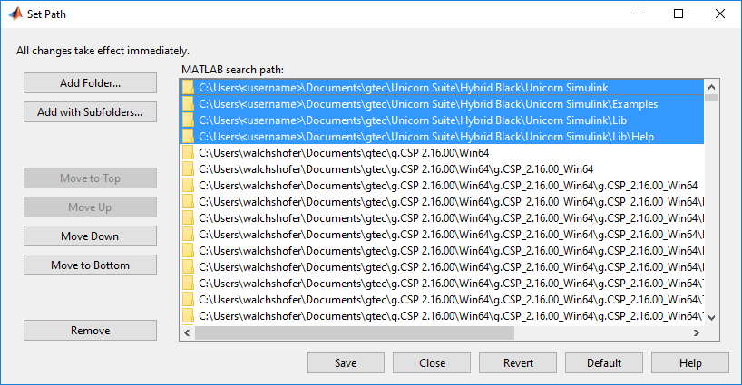
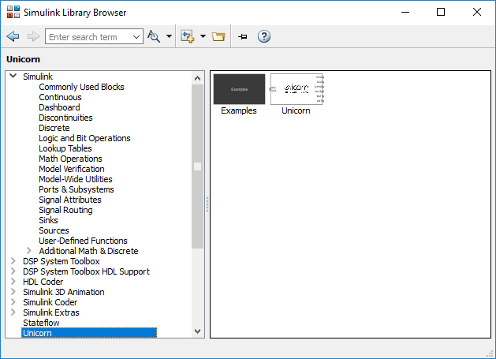
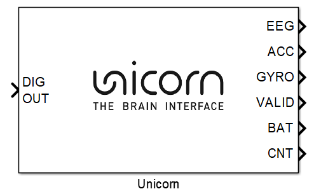
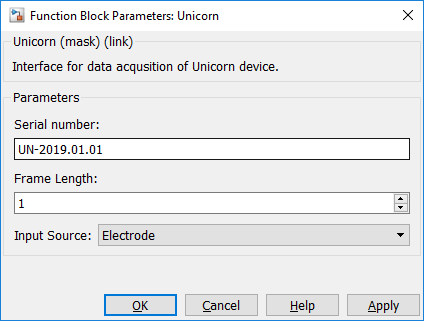
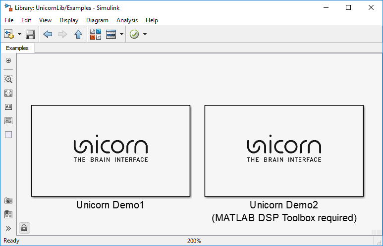
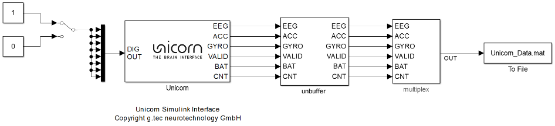
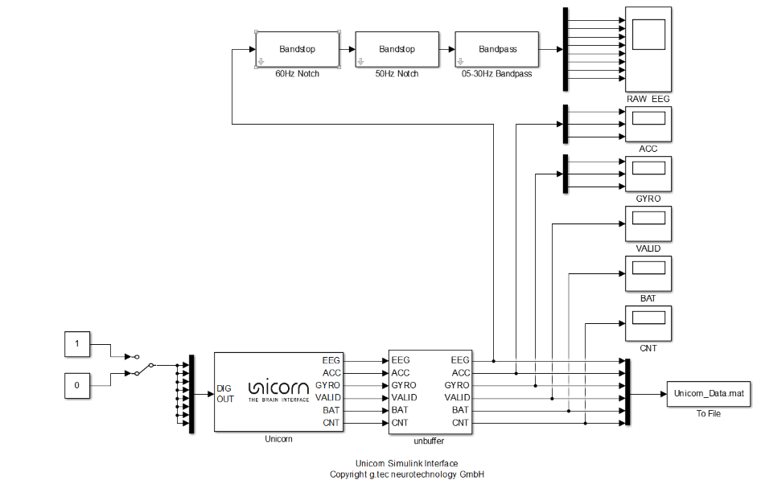

# Unicorn Simulink Interface

The Unicorn Simulink Interface is an interface that enables MATLAB Simulink applications to communicate with Unicorn brain interfaces. The Unicorn Simulink Interface allows users to acquire data from Unicorn devices easily without having to take care of low-level data acquisition issues. The raw binary data stream is converted into numerical values such that the user receives data ready to analyze.

[Requirements](#Requirements) 
[Files on your computer](#Files-on-your-computer) 
[Using the Unicorn Simulink Interface](#using-the-unicorn-simulink-interface) 
&nbsp;&nbsp;&nbsp;[Activate license](#activate-license) 
&nbsp;&nbsp;&nbsp;[Set library path](#set-library-path) 
[Simulink](#Simulink) 
[Unicorn .NET API Video Tutorial](#Unicorn-NET-API-Video-Tutorial) 
[.NET API Reference](./unicorn-dotnet-api-reference.md) 
&nbsp;&nbsp;&nbsp;[Unicorn Block](#unicorn-block) 
[Examples](#examples) 
&nbsp;&nbsp;&nbsp;[Demo 1](#demo-1) 
&nbsp;&nbsp;&nbsp;[Demo 2](#demo-2) 

## Requirements
## Files on your computer
By default, the Unicorn Simulink Interface library is installed to the Documents folder.
- C:\Users\<username>\Documents\gtec\Unicorn Suite\Hybrid Black\Unicorn Simulink 
Standard installation folder for the Unicorn Simulink Interface library

Within this directory, subdirectories are generated containing all installed files.

- .\Lib 
Contains the Unicorn Simulink Interface library for Windows 64-bit
- .\Lib\Help 
Contains documentation of the Unicorn Simulink Interface library
- .\Examples 
Contains application examples for the Unicorn Simulink Interface library in MATLAB Simulink

## Using the Unicorn Simulink Interface
### Activate license
The Unicorn Python library requires a license key to load. Unlock the Unicorn Python API by following the 
instructions from [Licensing](TODO).

###  Set library path
You must add the Unicorn Simulink Interface library paths to the MATLAB path to use the library in MATLAB 
Simulink applications

1. Open MATLAB 2013a
2. Select “Set Path” in the Home tab to modify the MATLAB path
3. Select “Add with Subfolders” and add the Unicorn Simulink Interface library folders to the path 
(by default C:\Users\<username>\Documents\gtec\Unicorn Suite\Hybrid Black\Unicorn Simulink)

 

4. Click Save and Close to save the MATLAB path settings.

## Simulink
After the MATLAB Path configuration and license activation, the Unicorn Simulink Interface is ready for use. The Unicorn Simulink Interface is listed in the “Simulink Library Browser”. The Unicorn Simulink Interface consists of a Unicorn Block and application examples.

 

### Unicorn Block

 

The Unicorn Block provides a graphical interface to the Unicorn Brain Interface, which can be used in combination with MATLAB Simulink to configure the device and to acquire the data. 

Inputs 
- DIG OUT 
The input DIG OUT can be used to activate the digital output of the Unicorn brain interface. A value greater or equal to 1 will be treated as TRUE and the output will be set to a high. A value equal to zero is treated as FALSE and the output is set to low. 

Outputs 
- EEG 
The EEG output provides the signal of the 8 analog EEG channels.
- ACC 
The ACC output provides the signal of the three-axis accelerometer.
- GYRO 
The GYRO output provides the signal of the three-axis gyroscope.
- VALID 
The VALID output indicates if samples are lost during the data acquisition.
- BAT 
The BAT output provides the battery level in percent.
- CNT 
The CNT output is provides the system counter, which is incremented with every received sample during data acquisition.

Dialog Box 

 

- Serial Number 
Specify the serial number of the Unicorn brain interface used.
- Frame Length 
Select the number of samples in between 1 and 25 acquired per acquisition cycle.
- Input Source 
Switch between testsignal and EEG (Electrode) as input source for the acquisition.

## Examples
The Unicorn Simulink Interface library is delivered with example MATLAB Simulink models.

1.	Open MATLAB 2017a and the “Simulink Library Browser”.
2.	Select the “Unicorn” library from the dropdown menu.
3.	Double click the “Examples” block.
4.	Select one of the example applications.

 

### Demo 1
This application acquires all available signal channels and writes them to a file.
1.	Double click the Unicorn block to configure the device.
2.	Change the “Serial Number” to the serial of the device used.
3.	Turn on the Unicorn brain interface.
4.	Click “Play” to start the MATLAB Simulink model.

 

### Demo 2
This application acquires all available signal channels and writes them to a file. All channels can be visualized with a data viewer. EEG data visualized in the EEG scope is filtered with a 50Hz Notch filter, a 60Hz Notch filter and a 0.5 to 30Hz Bandpass filter.
1.	Double click the Unicorn block to configure the device.
2.	Change the “Serial Number” to the serial of the device used.
3.	Turn on the Unicorn brain interface.
4.	Click “Play” to start the MATLAB Simulink model.

 

